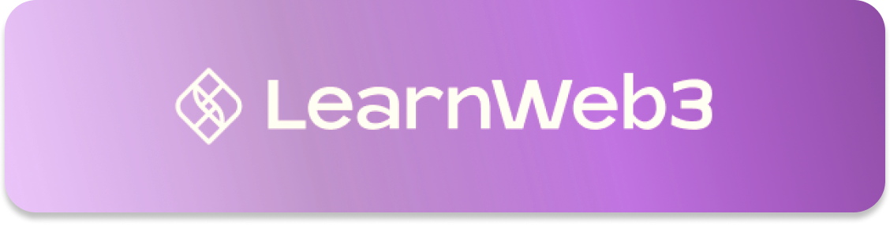
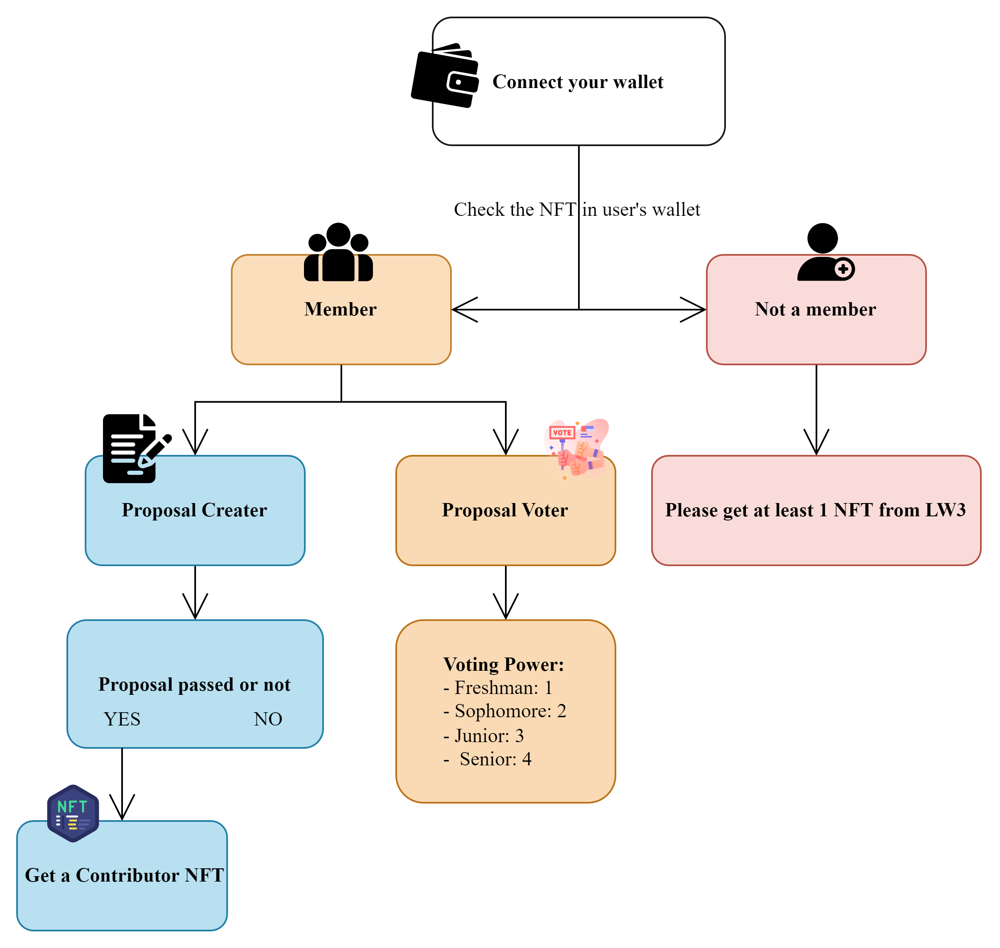

# LearnWeb3 DAO Whitepaper v1

## What is LearnWeb3 ?
LearnWeb3 is a free, high quality, holistic education platform to onboard you as a web3 developer. Click [here](https://learnweb3.io/) to join 40k+ builders and start your journey today.

## Introduction to LW3DAO
LearnWeb3 DAO is a platform that **improves LW3 Community**.

As the community grows, we found that there might be things remain improvable. Instead of holding the power in the minority, we are looking forward to bringing **the power of governance back to the community itself**. 

A LearnWeb3 learner can become a LW3DAO member, who has the right to **create a proposal** and **vote a proposal**. The voting system will **automately** calculate the voting result and share to the LW3DAO. 

## Who will get the membership of LW3 DAO?
Anyone who owns at least **ONE** LearnWeb3 NFT (Freshman, Sophomore, Junior, Senior) is able to get the membership of LW3DAO.

## LearnWeb3 Improvement Proposals (LIP👄)
### What is a proposal?
Just like EIP (Ethereum Improvement Proposals), LIP are the proposals that improve LW3 Community. If a DAO member observe any issue/ problem in our community, he/ she can create a proposal by our system. 

### What is the proposal format?
Every Proposal must have a
- **Title:** Title of the proposal.
- **Description:** Simple description of the proposal. 
- **PDF Link:** A pdf link of the proposal. More detail about the proposal in this file.

Every Proposal should be a
- **YES/NO Question:** Our system now can only decide the issue is pass or not. 

Every Proposal has a 
- **Deadline:** A period of time in which members can vote. After deadline, the system will execute to see the result.
### Mechanism
The voting system is shown below.

1. First of all, connect the wallet to LW3DAO.
2. System will detect whether the user has a LW3 NFT or not.
3. If NO, we'll recommend to get one from LW3.
4. If YES, the user is able to **CREATE** and **VOTE**.
5. There are two identity in the system.
   - Proposal Creater: The one who create a proposal.
   - Voter: After a creation of a proposal, voters can vote with their voting power.
6. After the deadline, system will execute and show the result to LW3DAO. 
#### Voting Power
In this system, voters have 4 voting power and the power is depend on what LW3 NFT a member owns.
- **Freshman:** 1 voting power
- **Sophomore:** 2 voting power
- **Junior:** 3 voting power
- **Senior:** 4 voting power

#### Contributor NFT
Moreover, we design a **reward system** for member to create a constructive proposal.
- Any Proposal Creater will get a Contributor NFT after his/her proposal is passed.

## Technologies used in LW3 DAO

### Front-end
#### Next.js
Next.js is a React Framework, which give us great experience when developing the whole website. By using this framework, we are able to divide pages into different components and develop seperately.

#### Wallet Connection
For wallet connection, we use a 

#### Moralis API
We use Moralis API in `fetchData.js` in order to fetch the user's NFT metadata from LearnWeb3, which helps our system to distinguish the membership and determine voting power. 

### Polygon
All of our contracts are deployed and tested on the Polygon testnet -- Mumbai so that our DApp can fetch the NFT metadata correctly and have interactions without paying gas fee. We intend to launch LW3DAO to the Polygon mainnet in the future.

### Back-end 
The smart contracts can be found in [/backend/contracts]().

#### LW3DAO.sol
In LW3DAO 
#### ContributorNFT.sol

## Founders
